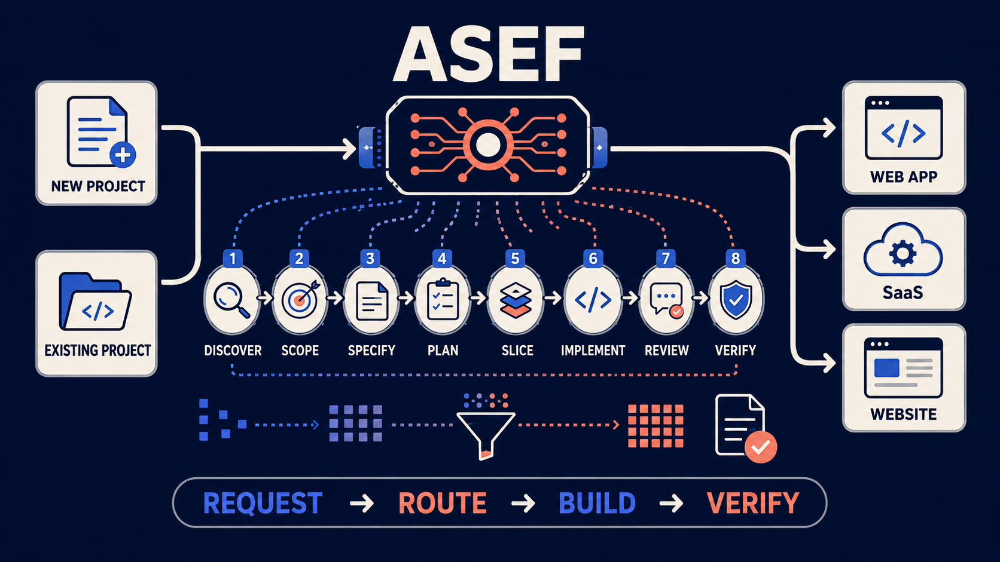
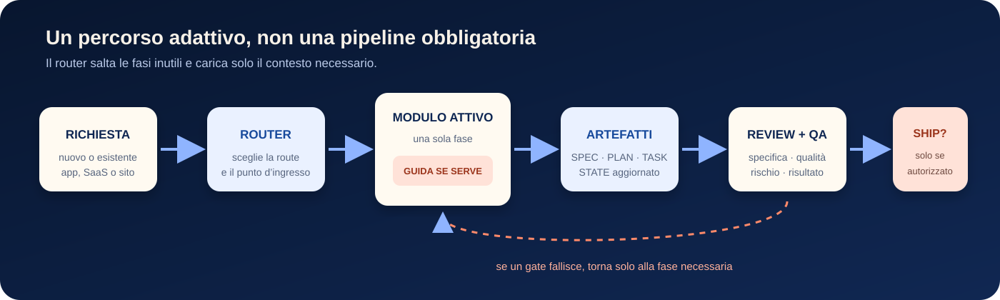
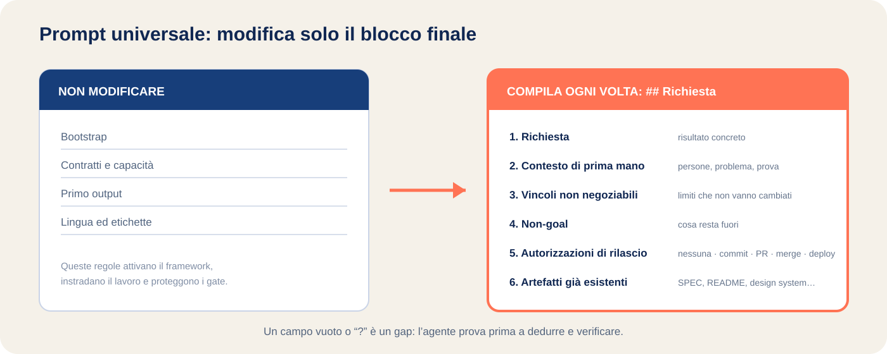

# ASEF

**Agentic Software Engineering Framework** — un processo operativo modulare per
guidare agenti di coding nella creazione e modifica di web app, SaaS e siti web
professionali.

[](https://github.com/MrForty/asef/actions/workflows/consistency.yml)




ASEF non è un generatore di codice e non sostituisce l'agente. È un insieme di
documenti Markdown che gli fornisce un metodo: comprende la richiesta, sceglie
il percorso più corto, carica soltanto il contesto necessario, produce artefatti
verificabili e controlla il risultato prima del rilascio.

- Nessuna dipendenza di runtime.
- Nessun modello, IDE, plugin o provider obbligatorio.
- Funziona su progetti nuovi ed esistenti.
- Mantiene `AUTO` per l'autonomia e `ECONOMY` per contenere il contesto.
- Non pubblica, unisce o distribuisce nulla oltre l'autorizzazione ricevuta.

## Quando usarlo

| Obiettivo | Cosa fa ASEF |
|---|---|
| Nuova web app o SaaS | Chiarisce risultato e confini, definisce comportamento e architettura minima, divide il lavoro in incrementi verificabili |
| Nuovo sito professionale | Parte da pubblico e contenuti, definisce una direzione visiva specifica, verifica una pagina rappresentativa e completa la consegna web |
| Feature su un progetto esistente | Ricostruisce soltanto la baseline interessata, preserva stack e contratti, modifica il minimo necessario e controlla le regressioni |
| Bug | Riproduce il problema, individua la causa condivisa, applica la correzione più piccola e lascia una verifica eseguibile |
| Redesign | Distingue ciò che cambia da URL, contenuti, integrazioni e identità da conservare; confronta prima e dopo |
| Refactoring o debito tecnico | Richiede un limite reale e misurabile, evita astrazioni speculative e mantiene il comportamento esterno |
| Review o QA | Controlla specifica, qualità, rischio e risultato senza forzare modifiche o fasi inutili |

## Come funziona



ASEF non obbliga ogni lavoro a percorrere tutte le fasi. Il router sceglie la
route e il punto di ingresso in base all'intento:

| Route | Quando entra in gioco | Percorso tipico |
|---|---|---|
| `GREENFIELD` | Prodotto o sito nuovo | discovery → product-scope → specification → planning → slicing → implementation → review → qa |
| `MODIFY` | Funzione o comportamento da modificare | specification? → planning? → slicing? → implementation → review → qa |
| `DIAGNOSE` | Bug, regressione o causa sconosciuta | diagnose → implementation → review → qa |
| `IMPROVE` | Refactoring o limite architetturale provato | architecture-improvement → planning? → implementation → review → qa |
| `REUSE` | Codice o componente esterno da integrare | reuse-integration → specification/planning? → implementation → review → qa |
| `REVIEW_ONLY` | Analisi senza modifiche | review → fine |
| `QA_ONLY` | Verifica di un risultato esistente | qa → fine |
| `RELEASE` | Commit, PR, merge o deploy autorizzato | qa? → ship → fine |

Il simbolo `?` indica una fase caricata solo quando serve. Se un controllo
fallisce, ASEF torna alla fase che deve correggere il problema, senza ripetere
l'intero percorso.

## Avvio rapido

### 1. Installa il framework nel progetto

Copia questa repository nella cartella `asef/` del progetto:

```text
progetto/
├── asef/
│   ├── ASEF.md
│   ├── ROUTER.md
│   ├── modules/
│   ├── guides/
│   └── templates/
├── AGENTS.md              # opzionale: attivazione permanente
├── PROJECT.md             # generato solo quando necessario
├── SPEC.md                # generato solo quando necessario
└── STATE.md               # stato compatto del lavoro
```

### 2. Scegli come attivarlo

**Attivazione occasionale.** Apri
[`prompt universale ASEF.txt`](prompt%20universale%20ASEF.txt), compila il
blocco finale `## Richiesta` e incolla l'intero file nell'agente.

**Attivazione permanente.** Copia il blocco di
[`templates/AGENTS.template.md`](templates/AGENTS.template.md) nel file di
istruzioni letto dal tuo agente, per esempio `AGENTS.md` o `CLAUDE.md`. Da quel
momento puoi inviare direttamente la richiesta; l'agente riparte da `STATE.md`
quando esiste.

### 3. Lascia che ASEF scelga il percorso

Con il prompt universale, il primo output dichiara route, modulo attivo,
artefatti, capacità disponibili, prossima azione, gap e azioni umane. Non devi
scegliere manualmente moduli, stack o route se non vuoi imporli come vincolo.

## Il prompt universale: cosa modificare



Modifica **soltanto il blocco `## Richiesta` in fondo al file**. Le sezioni
`Bootstrap`, `Contratti e capacità`, `Primo output` e `Lingua ed etichette`
attivano il framework e devono rimanere invariate.

```text
Richiesta: <una frase: cosa deve fare>

Contesto di prima mano:
- chi ha il problema:
- come lo risolve oggi:
- chi me l'ha chiesto, e cosa ha fatto (non cosa ha detto):
- come capisco che funziona:

Vincoli non negoziabili:
-

Non-goal:
-

Autorizzazioni di rilascio: <nessuna | commit | pull request | merge | deploy>

Artefatti già esistenti: <nessuno | elenco>
```

### Significato dei campi

| Campo | Cosa scrivere | Esempio breve |
|---|---|---|
| `Richiesta` | Il risultato concreto, espresso come comportamento osservabile | “Aggiungi un filtro combinabile alla lista fatture” |
| `chi ha il problema` | Persona o ruolo che userà il risultato | “Operatori amministrativi di piccole agenzie” |
| `come lo risolve oggi` | Procedura o alternativa realmente usata | “Esporta in Excel e filtra manualmente” |
| `chi me l'ha chiesto...` | Evidenza concreta, quando esiste | “Due operatori hanno mostrato il foglio usato ogni giorno” |
| `come capisco che funziona` | Segnale o prova osservabile | “I filtri funzionano insieme e rispettano la paginazione” |
| `Vincoli non negoziabili` | Limiti che l'agente non deve reinterpretare | Stack esistente, compatibilità API, lingua, piattaforma |
| `Non-goal` | Risultati esplicitamente fuori dallo scope | “Nessun redesign completo” |
| `Autorizzazioni di rilascio` | L'ultimo passo esterno consentito | `nessuna`, `commit`, `pull request`, `merge`, `deploy` |
| `Artefatti già esistenti` | Documenti canonici da leggere e aggiornare | `README.md`, `SPEC.md`, documentazione API, design system |

Un campo vuoto, omesso o marcato `?` viene trattato come un gap. L'agente prova
prima a dedurlo dagli artefatti, dal codice o da ricerca mirata. Fa una domanda
solo se la risposta cambia materialmente il prodotto o blocca un'azione sicura.

### Autorizzazioni di rilascio

Le autorizzazioni fissano il limite massimo:

| Valore | ASEF può arrivare fino a |
|---|---|
| `nessuna` | Risultato locale verificato; nessuna pubblicazione |
| `commit` | Commit locale sul branch di lavoro |
| `pull request` | Commit, push del branch e apertura o aggiornamento della PR |
| `merge` | Merge della PR dopo i controlli richiesti |
| `deploy` | Distribuzione e verifica post-rilascio secondo il piano |

In caso di dubbio usa `nessuna`. Il silenzio non concede autorizzazione.

## Esempi completi di prompt

Gli esempi mostrano come cambiare soltanto il blocco finale. Copiali e sostituisci
le parti specifiche del tuo progetto.

<details>
<summary><strong>Nuovo SaaS per agenzie di viaggio</strong></summary>

```text
Richiesta: Realizza un SaaS per piccole agenzie di viaggio che permetta di creare viaggi di gruppo, gestire partecipanti, posti disponibili e pagamenti ricevuti.

Contesto di prima mano:
- chi ha il problema: agenzie di viaggio con due o cinque operatori
- come lo risolve oggi: fogli Excel, messaggi WhatsApp e ricevute controllate manualmente
- chi me l'ha chiesto, e cosa ha fatto (non cosa ha detto): due agenzie mi hanno mostrato i fogli usati per seguire prenotazioni e pagamenti
- come capisco che funziona: un operatore crea un viaggio, registra un partecipante e vede immediatamente disponibilità e saldo

Vincoli non negoziabili:
- applicazione web responsive
- separazione completa dei dati tra agenzie
- interfaccia in italiano
- esecuzione locale tramite Docker

Non-goal:
- applicazione mobile nativa
- contabilità fiscale completa
- integrazione immediata con tutti i gateway di pagamento

Autorizzazioni di rilascio: pull request

Artefatti già esistenti: nessuno
```

Route attesa: `GREENFIELD`. ASEF chiarisce il primo risultato utile, crea la
specifica, sceglie l'architettura minima e realizza una prima slice completa.

</details>

<details>
<summary><strong>Nuovo sito professionale per uno studio di architettura</strong></summary>

```text
Richiesta: Realizza un sito professionale originale per uno studio di architettura, con portfolio dei progetti, servizi, profilo dello studio e richiesta di contatto funzionante.

Contesto di prima mano:
- chi ha il problema: potenziali clienti privati e aziende che devono valutare stile ed esperienza dello studio
- come lo risolve oggi: ricevono presentazioni PDF e fotografie tramite email
- chi me l'ha chiesto, e cosa ha fatto (non cosa ha detto): lo studio ha fornito fotografie, descrizioni di otto progetti e contatti reali
- come capisco che funziona: il visitatore comprende specializzazione e stile, consulta i progetti e invia una richiesta realmente ricevuta

Vincoli non negoziabili:
- usare esclusivamente testi, fotografie e dati verificati
- design editoriale contemporaneo coerente con i progetti dello studio
- accessibilità WCAG 2.2 AA come obiettivo
- ottima esperienza mobile
- nessuna dipendenza obbligatoria da servizi proprietari

Non-goal:
- area clienti
- e-commerce
- testimonianze, riconoscimenti o statistiche inventate
- animazioni decorative invasive

Autorizzazioni di rilascio: pull request

Artefatti già esistenti: cartella assets/, brief-studio.md, contenuti-progetti.md
```

Route attesa: `GREENFIELD`, con la guida
[Web Experience](guides/web-experience.md). ASEF definisce contenuti,
gerarchia e direzione visiva, verifica una pagina rappresentativa prima di
replicarla e controlla responsive, accessibilità, URL, metadata e form reali.

</details>

<details>
<summary><strong>Nuova feature in un SaaS esistente</strong></summary>

```text
Richiesta: Aggiungi alla pagina delle fatture un filtro combinabile per stato, cliente e intervallo di date, mantenendo paginazione e separazione dei dati tra tenant.

Contesto di prima mano:
- chi ha il problema: operatori amministrativi che gestiscono centinaia di fatture
- come lo risolve oggi: scorrono le pagine oppure esportano i dati e li filtrano in Excel
- chi me l'ha chiesto, e cosa ha fatto (non cosa ha detto): un operatore ha mostrato che esporta le fatture diverse volte al giorno
- come capisco che funziona: i filtri funzionano singolarmente e insieme, restano attivi durante la paginazione e non mostrano dati di altri tenant

Vincoli non negoziabili:
- mantenere stack e design system esistenti
- non modificare il formato delle API pubbliche
- preservare le modifiche locali non collegate
- applicare autorizzazione e tenant filtering sul server

Non-goal:
- riprogettazione completa della pagina fatture
- sostituzione del database
- modifica del processo di pagamento

Autorizzazioni di rilascio: pull request

Artefatti già esistenti: README.md, PROJECT.md, SPEC.md, documentazione API esistente
```

Route attesa: `MODIFY`, con la guida
[Existing Projects](guides/existing-projects.md). ASEF ricostruisce la
baseline interessata, mantiene i contratti esistenti e verifica filtri,
paginazione, autorizzazione e isolamento dei tenant.

</details>

<details>
<summary><strong>Redesign della homepage di un sito esistente</strong></summary>

```text
Richiesta: Ridisegna la homepage mantenendo contenuti verificati, URL, identità tipografica e modulo di contatto esistente; migliora gerarchia, responsive e presentazione dei progetti.

Contesto di prima mano:
- chi ha il problema: visitatori che non comprendono rapidamente servizi e progetti principali
- come lo risolve oggi: navigano diverse pagine prima di trovare le informazioni rilevanti
- chi me l'ha chiesto, e cosa ha fatto (non cosa ha detto): il proprietario ha fornito registrazioni di sessione e richieste ricevute tramite il modulo
- come capisco che funziona: la homepage comunica attività e progetti principali, funziona alle larghezze concordate e il modulo continua a consegnare realmente le richieste

Vincoli non negoziabili:
- conservare framework, URL pubblici e integrazioni
- riutilizzare font, fotografie e contenuti approvati
- mantenere funzionante il modulo di contatto
- documentare il confronto prima e dopo

Non-goal:
- modifica delle pagine interne
- migrazione del CMS
- riscrittura dei contenuti
- testimonianze o metriche non fornite

Autorizzazioni di rilascio: pull request

Artefatti già esistenti: README.md, design-system.md, content/, public/images/
```

Route attesa: `MODIFY`, con entrambe le guide condizionali. La baseline protegge
le parti fuori dallo scope; la review visiva controlla identità, contenuti,
responsive, accessibilità e funzionamento reale del contatto.

</details>

<details>
<summary><strong>Correzione di un bug in una web app esistente</strong></summary>

```text
Richiesta: Correggi il menu mobile che non si chiude dopo la selezione di una voce e aggiungi una verifica che impedisca la regressione.

Contesto di prima mano:
- chi ha il problema: utenti della web app su smartphone
- come lo risolve oggi: chiudono manualmente il menu prima di usare la pagina
- chi me l'ha chiesto, e cosa ha fatto (non cosa ha detto): il team ha fornito una riproduzione sul browser mobile
- come capisco che funziona: dopo la selezione il menu si chiude, il focus resta corretto e la navigazione continua

Vincoli non negoziabili:
- mantenere componenti e dipendenze esistenti
- preservare navigazione desktop e uso da tastiera

Non-goal:
- redesign della navigazione
- aggiornamento generale delle dipendenze

Autorizzazioni di rilascio: commit

Artefatti già esistenti: README.md, test/e2e/, src/components/navigation/
```

Route attesa: `DIAGNOSE`. L'assenza di artefatti ASEF non rende greenfield un
progetto già funzionante: l'agente riproduce il difetto, segue i chiamanti,
corregge la causa e verifica mobile, desktop e tastiera.

</details>

## Qualità dei siti: originalità senza “AI slop”

La guida [Web Experience](guides/web-experience.md) trasforma “crea un sito
originale” in criteri osservabili:

- composizione derivata da pubblico, contenuti e azione principale;
- gerarchia e copy basati su materiale reale;
- direzione visiva e token documentati una volta, poi riutilizzati;
- niente testimonianze, loghi, premi, metriche o successi inventati;
- gradienti, card, hero enormi e pill sono scelte motivate, non default;
- una vista rappresentativa verificata su larghezza stretta e ampia prima di
  moltiplicare il pattern;
- form e azioni collegati a destinazioni reali, con errori e successo visibili;
- accessibilità, performance e indicizzazione controllate solo quando
  applicabili e senza promesse non dimostrate.

Una dashboard privata non riceve lavoro SEO inutile. Una correzione locale non
attiva un redesign. Originalità non significa sacrificare chiarezza,
accessibilità o controlli familiari.

## Modifica sicura dei progetti esistenti

La guida [Existing Projects](guides/existing-projects.md) impone una
baseline limitata al flusso interessato:

1. Leggere istruzioni locali, stato Git, manifesti, lockfile e punto d'ingresso.
2. Tracciare chiamanti, componenti, API, permessi e storage pertinenti.
3. Eseguire i controlli minimi esistenti e separare difetti precedenti da nuove
   regressioni.
4. Registrare delta richiesto, invarianti da preservare, percorsi interessati,
   verifica e rollback.
5. Modificare il punto condiviso più piccolo e controllare almeno un consumatore
   adiacente materialmente diverso.

ASEF conserva stack, versioni, route, API, schema, permessi, contenuti e design
fuori dallo scope. Una migrazione, riscrittura o sostituzione di dipendenza deve
risolvere un limite provato e avere un percorso di ritorno.

## Architettura dei file

| Percorso | Responsabilità |
|---|---|
| [`ASEF.md`](ASEF.md) | Kernel: default, runtime, gap policy, trait, risk class, version control e Definition of Done |
| [`ROUTER.md`](ROUTER.md) | Classificazione dell'intento e grafi delle route |
| [`DECISION-ENGINE.md`](DECISION-ENGINE.md) | Gestione delle incertezze, assunzioni, domande e autorizzazioni |
| [`CONTEXT-MANAGER.md`](CONTEXT-MANAGER.md) | Caricamento progressivo, memoria, fallback delle capacità e compressione |
| [`ARTIFACTS.md`](ARTIFACTS.md) | Artefatti canonici, ordine di autorità, aggiornamento ed evidenze |
| [`modules/`](modules/) | Tredici procedure caricate soltanto quando il relativo trigger scatta |
| [`guides/`](guides/) | Checklist condizionali per esperienza web e progetti esistenti |
| [`templates/`](templates/) | Scheletri di PROJECT, SPEC, PLAN, STATE, TASK, decisioni, ricerca e learnings |
| [`examples/scenarios.md`](examples/scenarios.md) | Scenari per valutare il comportamento di un agente; non caricati nel runtime |
| [`tools/`](tools/) | Linter di coerenza e test di mutazione del framework |

Gli artefatti generati (`PROJECT.md`, `SPEC.md`, `PLAN.md`, `STATE.md`, task,
decisioni, ricerca e learnings) vivono nella radice del progetto target. I file
in `asef/templates/` restano modelli riutilizzabili.

## Consumo di contesto

ASEF usa un kernel piccolo e carica progressivamente un solo modulo, le sezioni
necessarie degli artefatti e, quando applicabile, una guida condizionale.

- Kernel completo: meno di 6.000 token stimati.
- Singolo modulo o guida: massimo 1.200 token stimati.
- Prompt universale 1.7: circa 1.200 token stimati.
- `STATE.md`: puntatore compatto, non copia di specifica e piano.
- Output di ricerca e contesti paralleli: rientrano soltanto come evidenze
  compresse.

Le stime usano caratteri ÷ 4: servono come limite comparativo, non rappresentano
il tokenizer esatto di ogni modello.

## Verifica del framework

ASEF è composto soprattutto da contratti Markdown. Il linter verifica che i
file continuino a concordare su struttura, route, moduli, trait, risk class,
template, guide, riferimenti, versione e budget:

```bash
python3 tools/asef_lint.py -v
python3 tools/test_asef_lint.py
```

Su Windows usa `python` al posto di `python3`. I controlli girano in CI su
Linux e Windows e richiedono soltanto Python 3.11 o successivo.

Il linter dimostra coerenza strutturale; non dimostra che ogni modello seguirà
sempre il framework né certifica qualità estetica, sicurezza o accessibilità di
un progetto concreto. Gli scenari in [`examples/scenarios.md`](examples/scenarios.md)
servono a misurare questi aspetti con agenti e progetti reali.

## Principi essenziali

1. Deduci → verifica → chiedi.
2. Carica il minimo contesto sufficiente.
3. Patcha l'artefatto canonico; non creare riassunti concorrenti.
4. Riusa codice, piattaforma e dipendenze già presenti.
5. Implementa incrementi verticali osservabili.
6. Correggi la causa condivisa, non soltanto il sintomo segnalato.
7. Applica rigore proporzionato a impatto, rischio e reversibilità.
8. Non costruire lavoro speculativo.
9. Mantieni verifiche, sicurezza, accessibilità e integrità dei dati.
10. Rilascia soltanto entro l'autorizzazione ricevuta.

## Contribuire

Per contribuire, leggi [`CONTRIBUTING.md`](CONTRIBUTING.md), crea una pull
request focalizzata ed esegui entrambi i controlli. Mantieni ogni regola in un
solo file autorevole. Consulta anche il [codice di condotta](CODE_OF_CONDUCT.md)
e la [policy di sicurezza](SECURITY.md). La cronologia delle versioni è in
[`CHANGELOG.md`](CHANGELOG.md).
